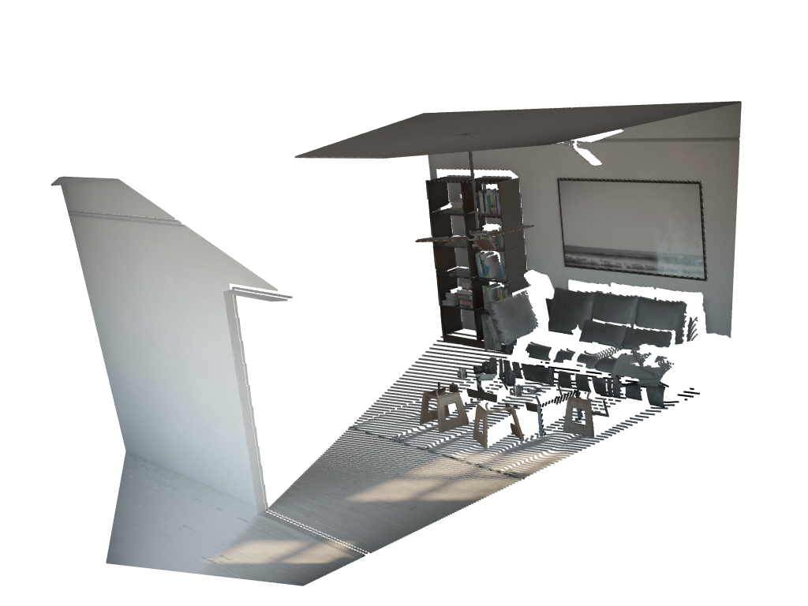
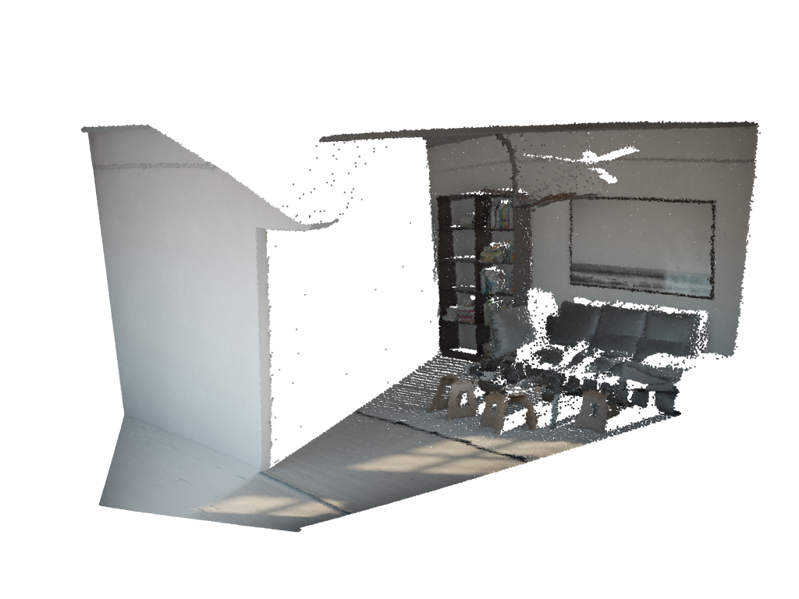
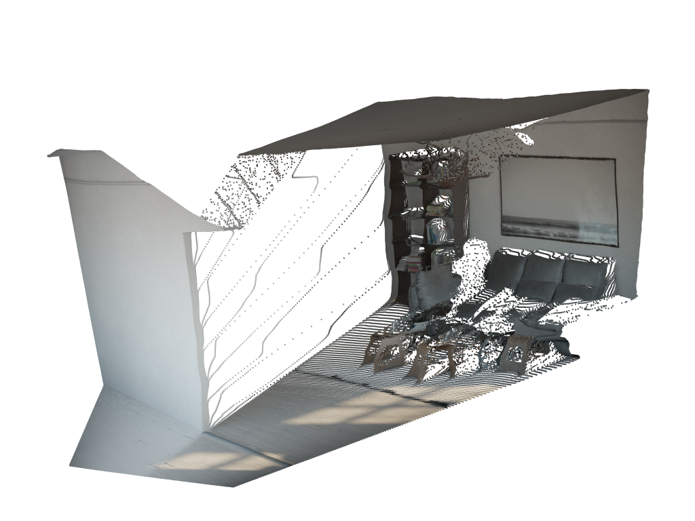
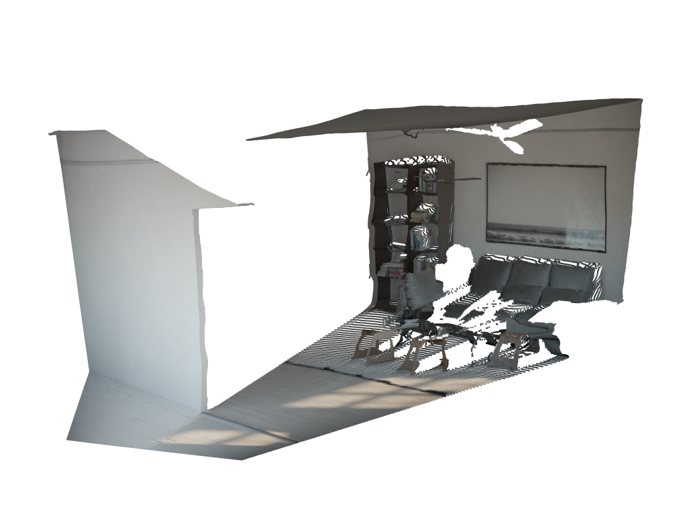

# Pixel-Perfect Depth Review

This project aims to evaluate and compare the performance of different monocular depth estimation models, specifically focusing on Pixel-Perfect Depth (PPD), Depth Anything v2 (DAv2), and DAv2 with a flying-pixel cleaning heuristic. The evaluation is conducted on the HyperSim dataset, which provides high-quality ground truth depth maps for benchmarking.

| Ground Truth | PPD |
| :---: | :---: |
|  |  |
| **DAv2** | **DAv2 Cleaned** |
|  |  |

## Installation with uv

We recommend using [uv](https://docs.astral.sh/uv/) for fast and reliable package management. To install it:

```bash
curl -LsSf https://astral.sh/uv/install.sh | sh
```


Then, to install all the dependencies and the project in editable mode:

```bash
uv sync
```

## Download data and models

```bash
uv run scripts/download/download_test_data.py
uv run scripts/download/download_models.py
```

## Launching experiments

```bash
uv run scripts/bench/benchmark.py # Needs GPU
uv run scripts/bench/generate_markdown_report.py
```

## Generating Visuals

```bash
uv run scripts/visu/precompute.py # Needs GPU
uv run scripts/visu/visualize.py
```

## Third-party Code Attribution

This project includes code from the following third-party source:

- **[Pixel-Perfect-Depth](https://github.com/gangweix/pixel-perfect-depth)** (Apache 2.0)
  - Vendored subset located in [src/ppdr/vendor/ppd/](src/ppdr/vendor/ppd/)
  - Original license: [LICENSE](src/ppdr/vendor/ppd/LICENSE)
  - Detailed credits and modifications: [README.md](src/ppdr/vendor/ppd/README.md)
